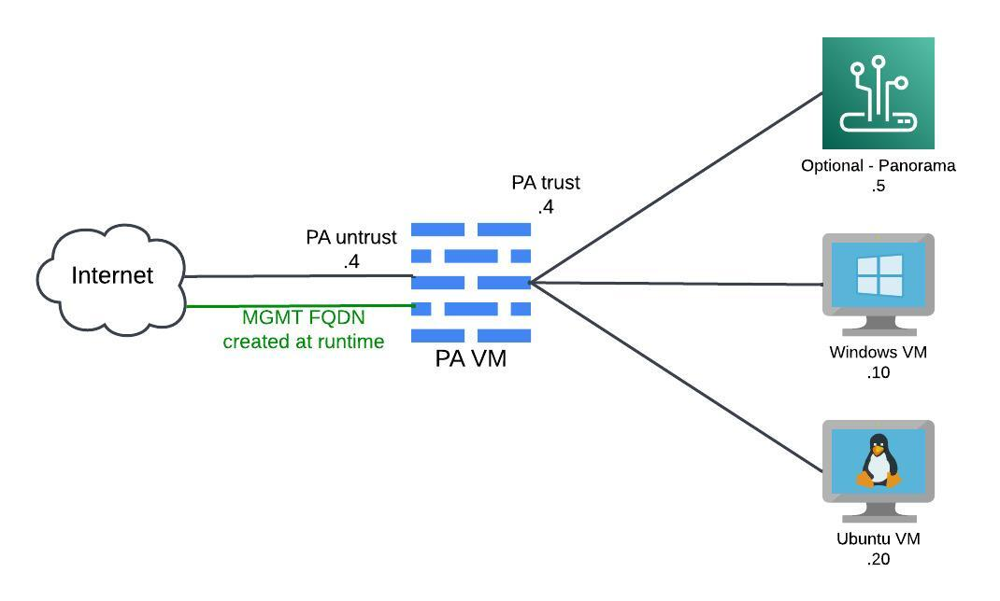

# PA Azure Lab Automation

- [PA Azure Lab Automation](#pa-azure-lab-automation)
  - [Overview](#overview)
  - [High Level Design](#high-level-design)
  - [Running this project](#running-this-project)
    - [Dependancies](#dependancies)
    - [Preparing to run](#preparing-to-run)
    - [Passing variables via a file](#passing-variables-via-a-file)
    - [Passving variables via CLI](#passving-variables-via-cli)
    - [Outputs](#outputs)
    - [Other variables that can be passed either via file or CLI](#other-variables-that-can-be-passed-either-via-file-or-cli)
    - [Creating a Panorama instance](#creating-a-panorama-instance)

## Overview

This project is a work in progress. Currently, the goal is an MVP that will deploy a Palo Alto VM firewall, required Azure networking components, a Windows and Ubuntu jump box, and a Panorama instance. The Panorama instance is based on a specific variable, `create_panorama`, being passed.

GitHub issues are used to track issues and additions to this project. Contributions are welcome. I will work on contribution guidelines, but for now, reach out directly to me, and we can coordinate.

## High Level Design

The CIDR deployed are based on the `role` variable and declared in `variables.tf`. Currently, three roles are accepted: sc, rn, and pan. Terraform will create a publicly available FQDN for the firewall untrust and management to facilitate establishing tunnels and management.

| Role | Description        | CIDR         | Untrust      | Trust        | MGMT          |
|------|--------------------|--------------|--------------|--------------|---------------|
| rn   | Remote Network     | 10.32.0.0/22 | 10.32.0.0/24 | 10.32.1.0/24 | 10.32.3.0/24  |
| sc   | Service Connection | 10.32.4.0/22 | 10.32.4.0/24 | 10.32.5.0/24 | 10.32.7.0/24  |
| pan  | Deploy Panorama    | 10.32.8.0/22 | 10.32.8.0/24 | 10.32.9.0/24 | 10.32.11.0/24 |
|      |                    |              |              |              |               |

After completing the devices will have the following fourth octects.

## Running this project

### Dependancies

This project is dependent on the Azure CLI and Terraform tools.

Project development used the following versions:

| Package   | Version |
|-----------|---------|
| terraform | 1.9.2   |
| az-cli    | 2.62.0  |

**Note**: This project has yet to be tested on OpenTofu.

To install Azure CLI tools, use the following link: https://learn.microsoft.com/en-us/cli/azure/install-azure-cli.

To install Terraform, use the following link: https://developer.hashicorp.com/terraform/tutorials/aws-get-started/install-cli.

### Preparing to run
* clone this repo `git clone https://github.com/jshively37/pa_azure_lab_automation.git`
* Login to Azure using the command `az login -use-device-code` command.
* Change directory to `terraform\environments\dev`.
* After logging in run `terraform init`.

### Passing variables via a file
* Create a `terraform.tfvars` file in the `terraform\environments\dev` directory.
  * `terraform.tfvars.example` is an example of the expected outputs.
* Run `terraform plan`.
* If you are happy with the output run `terraform apply`.
* This will take approximately 10 minutes to run.
* After completing, the firewall will take 5 minutes to boot up and accept logins.

### Passving variables via CLI
* Run `terraform plan -var="user_name={username}" -var="password={password}" -var="role={rn or sc}`.
  * If you create this without Panorama, you should see 20 to add.
  * If you create this with Panorama, you should see 22 to add.
* If you are happy with the output, run `terraform apply -var="user_name={username}" -var="password={password}" -var="role={role}"`.
* This will take approximately 10 minutes to run.
* After completing, the firewall will take 5 minutes to boot up and accept logins.

### Outputs

After running Terraform will output information useful to helping build and maintain the environment. Please make sure to save these and they can be retrieved from Azure if necessary.

`azure_untrust_gw`: The Azure gateway address for untrust firewall. This is used for the default route when sending traffic to the Internet.\
`ipsec_tunnel_ext_fqdn`: FQDN that can used for tunnel termination.\
`ipsec_tunnel_ext_ip`: IP address that can be used for tunnel termination.\
`mgmt_ext_fqdn`: FQDN to access the firewall for mgmt.\
`mgmt_ext_ip`: IP address to access the firewall for mgmt.\
`panorama_mgmt_ip` (optional): Trust zone IP address assigned to the Panorama instance.\
`subnet_range`: Subnet range that is used within Azure.\
`ubuntu_jumpbox_ip`: Trust zone IP address assigned to the Ubuntu jumpbox.\
`windows_jumpbox_ip`: Trust zone IP address assigned to the Windows jumpbox.

### Other variables that can be passed either via file or CLI

All available variables are defined in `terraform\environments\dev\variables.tf`. If you want to pass another value that isn't default, add it to the terraform.tfvars file or pass them via the cli using the `-var="variable={new value}`.

For example, if you want to change Azure regions, retrieve a list of the regions by entering in `az account list-locations -o table`. The automation expects the value in the second column called `Name`.

File: In `terraform.tfvars` add in `location = "{value from second column called Name}"`.
CLI: Pass `-var=location={value from second column called Name}` to both terraform plan and apply.

### Creating a Panorama instance

To deploy a Panorama instance you must set the variables `create_panorama=true` and `role=pan`.

File: In `terraform.tfvars` add in `create_panorama = true` and `role = pan`.
CLI: Pass `-var="create_panorama=true"` and `var="role=pan"` to both terraform plan and apply.
